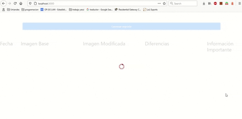

# Taller VRT
## Integrantes
* Juan Camilo Cárdenas
* Elkin Mantilla

## App paleta de colores
* Esta es la [aplicación](https://jcardenascandes93.github.io/colors-palette/) que genera la paleta de colores para realizar las pruebas VRT
* El código fuente de la aplicación se encuentra en este mismo repositorio

## Imágenes tomadas con ResembleJS
Las imágenes tomadas con ResembleJS sobre el ejercicio E2E realizado en talleres anteriores se encuantran [aquí](https://github.com/jcardenascAndes93/paletas-colores/tree/main/resemble)

## App de automatización de pruebas
* El [código fuente](https://github.com/jcardenascAndes93/paletas-colores/tree/main/app-vrt) de la aplicación se encuentra en este repositorio
* La aplicación corre de manera local, para poder ejecutar la aplicación es necesario abrir la consola y ubicarse en el directorio raíz del proyecto e instalar los paquetes y dependencias ejecutando `npm install`. Una vez realizado el proceso de instalación el comando `npm start` inicia la aplicación en la URL `http://localhost:3000`.

## Preguntas
Las preguntas se encuentran resueltas en la [Wiki](https://github.com/jcardenascAndes93/paletas-colores/wiki/Cuestionario) del proyecto
